# Original

# coffee.fakefilter
*Load with:*
```
{:class coffee.FakeFilter, :rotationAngle 2.0}
```
*Result:*


Execution Time: 0 ms

# com.boylett.t.coincounter.coincounter
*Load with:*
```
{:class com.boylett.t.coincounter.CoinCounter}
```
*Result:*


Execution Time: 11 ms

# origami.filters.noop
*Load with:*
```
{:class origami.Filters$NoOP}
```
*Result:*


Execution Time: 0 ms

# origami.artcodes.whitebalanceprocessor
*Load with:*
```
{:class origami.artcodes.WhiteBalanceProcessor}
```
*Result:*


Execution Time: 0 ms

# annotate
*Load with:*
```
{:class origami.filters.Annotate, :color "#FFFFFF", :fontSize 3.0, :point "50.0,50.0", :text "hello", :thickness 3}
```
*Result:*


Execution Time: 0 ms

# backgroundsubstractor
*Load with:*
```
{:class origami.filters.BackgroundSubstractor, :learningRate 1.0, :showMask false, :useMOG2 false}
```
*Result:*


Execution Time: 3 ms

# bitwisered
*Load with:*
```
{:class origami.filters.BitwiseRed}
```
*Result:*


Execution Time: 0 ms

# blacktoblue
*Load with:*
```
{:class origami.filters.BlackToBlue}
```
*Result:*


Execution Time: 9 ms

# canny
*Load with:*
```
{:class origami.filters.Canny, :inverted true, :threshold1 100, :threshold2 200}
```
*Result:*


Execution Time: 1 ms

# clojurefilter
*Load with:*
```
{:class origami.filters.ClojureFilter, :fn "(fn[mat] mat)"}
```
*Result:*


Execution Time: 0 ms

# colorfilter
*Load with:*
```
{:class origami.filters.ColorFilter, :high 20, :low 0}
```
*Result:*


Execution Time: 0 ms

# colorfilter.blue
*Load with:*
```
{:class origami.filters.ColorFilter$Blue, :high 240, :low 200}
```
*Result:*


Execution Time: 1 ms

# colorfilter.pink
*Load with:*
```
{:class origami.filters.ColorFilter$Pink, :high 320, :low 300}
```
*Result:*


Execution Time: 0 ms

# colorfilter.red
*Load with:*
```
{:class origami.filters.ColorFilter$Red, :high 20, :low 0}
```
*Result:*


Execution Time: 0 ms

# colormap
*Load with:*
```
{:class origami.filters.ColorMap}
```
*Result:*


Execution Time: 1 ms

# colormap.autumn
*Load with:*
```
{:class origami.filters.ColorMap$Autumn}
```
*Result:*


Execution Time: 0 ms

# colormap.bone
*Load with:*
```
{:class origami.filters.ColorMap$Bone}
```
*Result:*


Execution Time: 0 ms

# colormap.cividis
*Load with:*
```
{:class origami.filters.ColorMap$Cividis}
```
*Result:*


Execution Time: 0 ms

# colormap.cool
*Load with:*
```
{:class origami.filters.ColorMap$Cool}
```
*Result:*

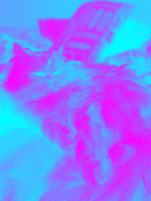

Execution Time: 0 ms

# colormap.hsv
*Load with:*
```
{:class origami.filters.ColorMap$HSV}
```
*Result:*


Execution Time: 1 ms

# colormap.hot
*Load with:*
```
{:class origami.filters.ColorMap$Hot}
```
*Result:*

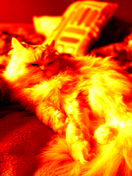

Execution Time: 0 ms

# colormap.jet
*Load with:*
```
{:class origami.filters.ColorMap$Jet}
```
*Result:*

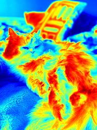

Execution Time: 0 ms

# colormap.magma
*Load with:*
```
{:class origami.filters.ColorMap$Magma}
```
*Result:*


Execution Time: 0 ms

# colormap.ocean
*Load with:*
```
{:class origami.filters.ColorMap$Ocean}
```
*Result:*


Execution Time: 0 ms

# colormap.parula
*Load with:*
```
{:class origami.filters.ColorMap$Parula}
```
*Result:*


Execution Time: 1 ms

# colormap.pink
*Load with:*
```
{:class origami.filters.ColorMap$Pink}
```
*Result:*


Execution Time: 0 ms

# colormap.rainbow
*Load with:*
```
{:class origami.filters.ColorMap$Rainbow}
```
*Result:*


Execution Time: 0 ms

# colormap.spring
*Load with:*
```
{:class origami.filters.ColorMap$Spring}
```
*Result:*


Execution Time: 0 ms

# colormap.summer
*Load with:*
```
{:class origami.filters.ColorMap$Summer}
```
*Result:*

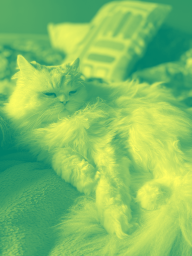

Execution Time: 0 ms

# colormap.turbo
*Load with:*
```
{:class origami.filters.ColorMap$Turbo}
```
*Result:*


Execution Time: 0 ms

# colormap.twilight
*Load with:*
```
{:class origami.filters.ColorMap$Twilight}
```
*Result:*


Execution Time: 0 ms

# colormap.twilightshifted
*Load with:*
```
{:class origami.filters.ColorMap$TwilightShifted}
```
*Result:*

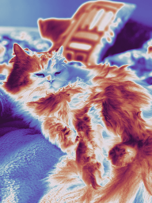

Execution Time: 0 ms

# colormap.viridis
*Load with:*
```
{:class origami.filters.ColorMap$Viridis}
```
*Result:*


Execution Time: 0 ms

# colormap.winter
*Load with:*
```
{:class origami.filters.ColorMap$Winter}
```
*Result:*


Execution Time: 0 ms

# contours
*Load with:*
```
{:class origami.filters.Contours, :color "#00EEEE", :linetype 8, :offset "0.0,0.0", :thickness 2, :threshold 100}
```
*Result:*


Execution Time: 5 ms

# coolcanny
*Load with:*
```
{:class origami.filters.CoolCanny, :inverted false}
```
*Result:*


Execution Time: 1 ms

# decolor
*Load with:*
```
{:class origami.filters.Decolor, :gray true}
```
*Result:*


Execution Time: 119 ms

# detailenhance
*Load with:*
```
{:class origami.filters.DetailEnhance, :sigma_r 0.15, :sigma_s 10.0}
```
*Result:*


Execution Time: 5 ms

# dynamicannotate
*Load with:*
```
{:class origami.filters.DynamicAnnotate, :color "#FFFFFF", :fontSize 3.0, :point "50.0,50.0", :text "(str (java.util.Date.))", :thickness 3}
```
*Result:*

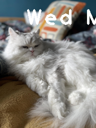

Execution Time: 3 ms

# edgepreserving
*Load with:*
```
{:class origami.filters.EdgePreserving, :flags 1, :sigma_r 0.4, :sigma_s 60.0}
```
*Result:*


Execution Time: 7 ms

# fps
*Load with:*
```
{:class origami.filters.FPS, :color "#FFFFFF", :fontSize 3.0, :point "50.0,50.0", :text "hello", :thickness 3}
```
*Result:*


Execution Time: 0 ms

# fastdenoising
*Load with:*
```
{:class origami.filters.FastDenoising}
```
*Result:*


Execution Time: 177 ms

# fisheye
*Load with:*
```
{:cX 300.0, :cY 540.0, :class origami.filters.Fisheye, :fishVal 600.0}
```
*Result:*


Execution Time: 1 ms

# gray
*Load with:*
```
{:class origami.filters.Gray}
```
*Result:*


Execution Time: 0 ms

# grayscale
*Load with:*
```
{:class origami.filters.Grayscale}
```
*Result:*


Execution Time: 0 ms

# greenlantern
*Load with:*
```
{:class origami.filters.GreenLantern}
```
*Result:*


Execution Time: 0 ms

# hog
*Load with:*
```
{:class origami.filters.HOG}
```
*Result:*


Execution Time: 5 ms

# httpget
*Load with:*
```
{:class origami.filters.HttpGet, :interval -1, :url nil}
```
*Result:*


Execution Time: 0 ms

# huesaturationvalue.gotham
*Load with:*
```
{:class origami.filters.HueSaturationValue$Gotham}
```
*Result:*


Execution Time: 1 ms

# huesaturationvalue.lomo
*Load with:*
```
{:class origami.filters.HueSaturationValue$Lomo}
```
*Result:*

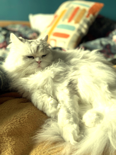

Execution Time: 0 ms

# huesaturationvalue.nashville
*Load with:*
```
{:class origami.filters.HueSaturationValue$Nashville}
```
*Result:*


Execution Time: 0 ms

# huesaturationvalue.pink
*Load with:*
```
{:class origami.filters.HueSaturationValue$Pink}
```
*Result:*


Execution Time: 0 ms

# illumination
*Load with:*
```
{:alpha 3.0, :beta 0.4, :class origami.filters.Illumination}
```
*Result:*


Execution Time: 46 ms

# level
*Load with:*
```
{:class origami.filters.Level, :n 100}
```
*Result:*

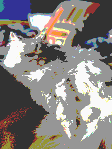

Execution Time: 17 ms

# mosaic
*Load with:*
```
{:class origami.filters.Mosaic, :factor 0.1}
```
*Result:*


Execution Time: 0 ms

# noopfilter
*Load with:*
```
{:class origami.filters.NoOPFilter}
```
*Result:*


Execution Time: 0 ms

# pencilsketch
*Load with:*
```
{:class origami.filters.PencilSketch, :gray false, :shade_factor 0.05, :sigma_r 0.07, :sigma_s 60.0}
```
*Result:*


Execution Time: 6 ms

# resize
*Load with:*
```
{:class origami.filters.Resize, :factor -1.0, :height -1.0, :width -1.0}
```
*Result:*


Execution Time: 0 ms

# rotate.rotate180
*Load with:*
```
{:class origami.filters.Rotate$Rotate180}
```
*Result:*


Execution Time: 0 ms

# rotate.rotate270
*Load with:*
```
{:class origami.filters.Rotate$Rotate270}
```
*Result:*

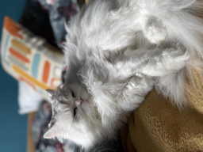

Execution Time: 0 ms

# rotate.rotate90
*Load with:*
```
{:class origami.filters.Rotate$Rotate90}
```
*Result:*


Execution Time: 0 ms

# rotatewithmatrix
*Load with:*
```
{:class origami.filters.RotateWithMatrix, :point "50.0,50.0"}
```
*Result:*

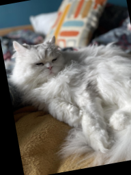

Execution Time: 0 ms

# stilyze
*Load with:*
```
{:class origami.filters.Stilyze, :sigma_r 0.07, :sigma_s 60.0}
```
*Result:*


Execution Time: 16 ms

# thresh
*Load with:*
```
{:class origami.filters.Thresh, :maxVal 255, :sensitivity 100}
```
*Result:*


Execution Time: 0 ms

# zoom
*Load with:*
```
{:class origami.filters.Zoom, :interpolation 1, :zoomingFactor 5}
```
*Result:*


Execution Time: 0 ms

# artcodes.hlseditimageprocessor
*Load with:*
```
{:class origami.filters.artcodes.HlsEditImageProcessor, :hue 0, :light 0, :repeat 1, :saturation 76}
```
*Result:*


Execution Time: 1 ms

# brandnew.alteringbrightness
*Load with:*
```
{:alpha 1.0, :beta 100.0, :class origami.filters.brandnew.AlteringBrightness}
```
*Result:*


Execution Time: 0 ms

# brandnew.alteringbrightness.darker
*Load with:*
```
{:alpha 1.0, :beta -80.0, :class origami.filters.brandnew.AlteringBrightness$Darker}
```
*Result:*


Execution Time: 0 ms

# brandnew.artisticfilter
*Load with:*
```
{:class origami.filters.brandnew.ArtisticFilter, :colorOverride "0.8,0.3,0.8,0.0", :gradient false, :gradientEnd "0.0,0.0,255.0,0.0", :gradientStart "255.0,255.0,255.0,0.0", :gradientWeight 0.3}
```
*Result:*


Execution Time: 0 ms

# brandnew.basiclinear
*Load with:*
```
{:alpha 2.0, :beta 0, :class origami.filters.brandnew.BasicLinear}
```
*Result:*


Execution Time: 10 ms

# brandnew.brightcircle
*Load with:*
```
{:brightnessOffset 50, :center "100.0,100.0", :class origami.filters.brandnew.BrightCircle, :color "#FFFFFF", :radius 100}
```
*Result:*


Execution Time: 12 ms

# brandnew.brightcircle.withhaar
*Load with:*
```
{:brightnessOffset 50, :center "100.0,100.0", :class origami.filters.brandnew.BrightCircle$WithHaar, :color "#FFFFFF", :maxSize 500, :minSize 300, :radius 100, :type "haar.frontalface"}
```
*Result:*


Execution Time: 1 ms

# brandnew.brushed
*Load with:*
```
{:blockSize 35, :c 10, :class origami.filters.brandnew.Brushed, :desiredColor "0.0,10.0,103.0,0.0", :kernelSize 17}
```
*Result:*


Execution Time: 0 ms

# brandnew.catmulrom
*Load with:*
```
{:class origami.filters.brandnew.CatMulRom}
```
*Result:*


Execution Time: 2 ms

# brandnew.comicbubble
*Load with:*
```
{:class origami.filters.brandnew.ComicBubble, :cornerRadius 10, :fontScale 1.0, :padding 10, :rotationAngle 30.0, :text "Hello!", :thickness 2}
```
*Result:*

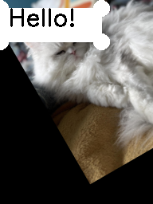

Execution Time: 1 ms

# brandnew.contrastfilter
*Load with:*
```
{:alpha 1.5, :beta 10.0, :class origami.filters.brandnew.ContrastFilter}
```
*Result:*


Execution Time: 0 ms

# brandnew.diffusinglight
*Load with:*
```
{:blurSize 0, :class origami.filters.brandnew.DiffusingLight, :contrastFix 75}
```
*Result:*


Execution Time: 8 ms

# brandnew.fakehdr
*Load with:*
```
{:class origami.filters.brandnew.FakeHDR, :colorAdaptation 0.0, :gamma 1.0, :intensity 1.0, :lightAdaptation 1.0}
```
*Result:*


Execution Time: 1 ms

# brandnew.gammacorrection
*Load with:*
```
{:class origami.filters.brandnew.GammaCorrection, :gamma 0.1}
```
*Result:*

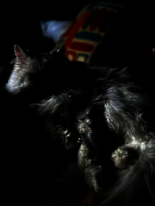

Execution Time: 0 ms

# brandnew.ghost
*Load with:*
```
{:alpha 0.5, :beta 0.5, :blur 1.0, :class origami.filters.brandnew.Ghost, :gamma 0.0, :paper "paper2", :sigmaX 30.0}
```
*Result:*


Execution Time: 0 ms

# brandnew.highcontrast
*Load with:*
```
{:alpha 1.5, :class origami.filters.brandnew.HighContrast}
```
*Result:*


Execution Time: 0 ms

# brandnew.histogram.circle
*Load with:*
```
{:bgColor "#FFFFFF", :bins 20, :class origami.filters.brandnew.Histogram$Circle, :paletteName "sunrise", :paletteReversed false}
```
*Result:*


Execution Time: 1 ms

# brandnew.histogram.circling
*Load with:*
```
{:y 0, :paletteName "sunrise", :radiusSize 10, :mainCircleThickness 1, :paletteReversed false, :bins 20, :circleSize 1, :class origami.filters.brandnew.Histogram$Circling, :x 0, :bgColor "#FFFFFF"}
```
*Result:*


Execution Time: 1 ms

# brandnew.histogram.gradient
*Load with:*
```
{:bgColor "#FFFFFF", :bins 20, :class origami.filters.brandnew.Histogram$Gradient, :paletteName "sunrise", :paletteReversed false}
```
*Result:*


Execution Time: 0 ms

# brandnew.histogram.heart
*Load with:*
```
{:bgColor "#FFFFFF", :bins 20, :class origami.filters.brandnew.Histogram$Heart, :paletteName "sunrise", :paletteReversed false}
```
*Result:*

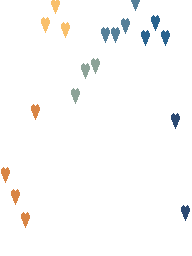

Execution Time: 1 ms

# brandnew.histogram.rect
*Load with:*
```
{:bgColor "#FFFFFF", :bins 20, :class origami.filters.brandnew.Histogram$Rect, :paletteName "sunrise", :paletteReversed false}
```
*Result:*


Execution Time: 1 ms

# brandnew.histogramcircle.grey
*Load with:*
```
{:class origami.filters.brandnew.HistogramCircle$Grey, :numberOfColors 256, :paletteName "sunrise", :paletteReversed false}
```
*Result:*

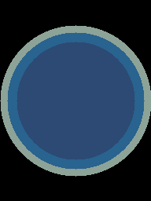

Execution Time: 13 ms

# brandnew.histogramcircle.jet
*Load with:*
```
{:class origami.filters.brandnew.HistogramCircle$Jet, :colorMap 0, :numberOfColors 256, :paletteName "sunrise", :paletteReversed false}
```
*Result:*


Execution Time: 2 ms

# brandnew.invert
*Load with:*
```
{:class origami.filters.brandnew.Invert}
```
*Result:*


Execution Time: 20 ms

# brandnew.manga2
*Load with:*
```
{:sigmaColor 30.0, :paletteName "sunrise", :kernelSize 17.0, :filterD 3.0, :sigmaSpace 75.0, :paletteReversed false, :cannyLow 5.0, :class origami.filters.brandnew.Manga2, :cannyHigh 100.0}
```
*Result:*


Execution Time: 2 ms

# brandnew.mosaical
*Load with:*
```
{:class origami.filters.brandnew.Mosaical, :color "#000000", :radiusRatio 2, :squareSize 10}
```
*Result:*

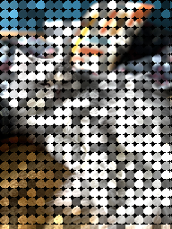

Execution Time: 8 ms

# brandnew.mostcolors
*Load with:*
```
{:class origami.filters.brandnew.MostColors, :coefficient 192.0}
```
*Result:*


Execution Time: 1 ms

# brandnew.negativebw
*Load with:*
```
{:class origami.filters.brandnew.NegativeBW, :darkRatio 0.2}
```
*Result:*

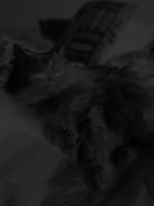

Execution Time: 0 ms

# brandnew.noise
*Load with:*
```
{:class origami.filters.brandnew.Noise}
```
*Result:*

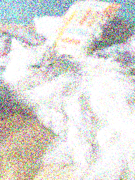

Execution Time: 1 ms

# brandnew.picasso
*Load with:*
```
{:paletteName "sunrise", :kernelSize 71, :numShapes 15, :paletteReversed false, :sigma 0, :cannyLow 1.0, :class origami.filters.brandnew.Picasso, :bgColor "#FFFFFF", :cannyHigh 250.0}
```
*Result:*


Execution Time: 4 ms

# brandnew.pinkforeground
*Load with:*
```
{:shadowThreshold 0.5, :paletteName "sunrise", :varMax 75.0, :shadowValue 127, :paletteReversed false, :detectShadows true, :varThreshold 16.0, :complexityReductionThreshold 0.05000000074505806, :history 500, :varMin 4.0, :maxContour -1, :backgroundRatio 0.8999999761581421, :varThresholdGen 9.0, :NMixtures 5, :class origami.filters.brandnew.PinkForeground, :varInit 15.0}
```
*Result:*


Execution Time: 1 ms

# brandnew.pixelsepia
*Load with:*
```
{:class origami.filters.brandnew.PixelSepia, :depth 20, :intensity 30}
```
*Result:*

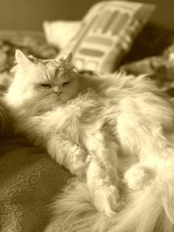

Execution Time: 22 ms

# brandnew.redblack
*Load with:*
```
{:class origami.filters.brandnew.RedBlack, :color0 "black", :color1 "red_1", :color2 "gray", :contourColor "white"}
```
*Result:*


Execution Time: 1 ms

# brandnew.redblack2
*Load with:*
```
{:class origami.filters.brandnew.RedBlack2}
```
*Result:*


Execution Time: 0 ms

# brandnew.reducepixels
*Load with:*
```
{:baseColor "white", :class origami.filters.brandnew.ReducePixels, :pixelCount 3}
```
*Result:*

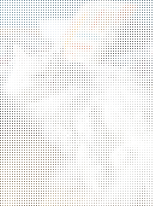

Execution Time: 3 ms

# brandnew.reducepixels2
*Load with:*
```
{:baseColor "white", :class origami.filters.brandnew.ReducePixels2, :pixelCount 3}
```
*Result:*


Execution Time: 1 ms

# brandnew.shadowfilter
*Load with:*
```
{:class origami.filters.brandnew.ShadowFilter}
```
*Result:*


Execution Time: 1 ms

# brandnew.shepard
*Load with:*
```
{:class origami.filters.brandnew.Shepard, :high 255, :low 127, :numLines 50, :specifiedColor "#FFFFFF", :thickness 1}
```
*Result:*


Execution Time: 0 ms

# brandnew.slowbw.v1
*Load with:*
```
{:class origami.filters.brandnew.SlowBW$V1}
```
*Result:*


Execution Time: 20 ms

# brandnew.slowbw.v2
*Load with:*
```
{:class origami.filters.brandnew.SlowBW$V2, :leftToRight false}
```
*Result:*

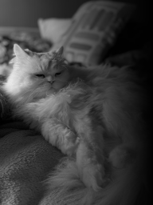

Execution Time: 0 ms

# brandnew.smallmats
*Load with:*
```
{:class origami.filters.brandnew.SmallMats, :mainCols 3, :mainRows 4, :max 10000}
```
*Result:*


Execution Time: 0 ms

# brandnew.sobelo
*Load with:*
```
{:class origami.filters.brandnew.Sobelo}
```
*Result:*


Execution Time: 0 ms

# brandnew.queen.hotspace
*Load with:*
```
{:class origami.filters.brandnew.queen.HotSpace, :lower 100, :upper 200}
```
*Result:*


Execution Time: 0 ms

# brandnew.queen.queen.blackwhite
*Load with:*
```
{:class origami.filters.brandnew.queen.Queen$BlackWhite, :lower 10, :main "#FFFFFF", :sub "#000000", :upper 150}
```
*Result:*

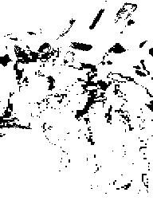

Execution Time: 0 ms

# brandnew.queen.queen.brian
*Load with:*
```
{:class origami.filters.brandnew.queen.Queen$Brian, :lower 10, :main "#C3C3C3", :sub "#FCFF02", :upper 150}
```
*Result:*


Execution Time: 1 ms

# brandnew.queen.queen.freddy
*Load with:*
```
{:class origami.filters.brandnew.queen.Queen$Freddy, :lower 10, :main "#43007C", :sub "#FF0006", :upper 150}
```
*Result:*


Execution Time: 1 ms

# brandnew.queen.queen.john
*Load with:*
```
{:class origami.filters.brandnew.queen.Queen$John, :lower 10, :main "#FE2400", :sub "#049CC3", :upper 150}
```
*Result:*


Execution Time: 0 ms

# brandnew.queen.queen.roger
*Load with:*
```
{:class origami.filters.brandnew.queen.Queen$Roger, :lower 10, :main "#FE2C99", :sub "#029020", :upper 150}
```
*Result:*

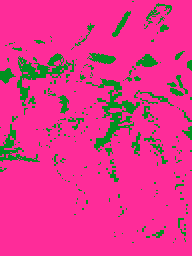

Execution Time: 0 ms

# cartoon.cartoon
*Load with:*
```
{:blockSize 9, :c 2, :class origami.filters.cartoon.Cartoon, :d 13, :ksize 7, :maxValue 255.0, :sigmaColor 13, :sigmaSpace 7}
```
*Result:*

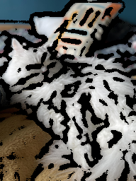

Execution Time: 2 ms

# cartoon.cartoon2
*Load with:*
```
{:class origami.filters.cartoon.Cartoon2}
```
*Result:*


Execution Time: 3 ms

# cartoon.lutcartoon
*Load with:*
```
{:class origami.filters.cartoon.LUTCartoon}
```
*Result:*


Execution Time: 3 ms

# cartoon.manga
*Load with:*
```
{:class origami.filters.cartoon.Manga}
```
*Result:*

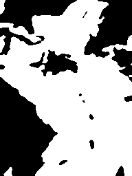

Execution Time: 0 ms

# detect.haar
*Load with:*
```
{:class origami.filters.detect.Haar, :color "255.0,255.0,255.0,0.0", :text "Gatos", :type "haar.frontalcatface"}
```
*Result:*


Execution Time: 1 ms

# detect.yolo.myyolo.v2
*Load with:*
```
{:class origami.filters.detect.yolo.MyYolo$V2}
```
*Result:*

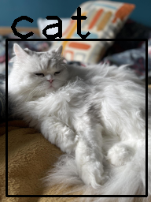

Execution Time: 650 ms

# detect.yolo.myyolo.v2tiny
*Load with:*
```
{:class origami.filters.detect.yolo.MyYolo$V2Tiny}
```
*Result:*


Execution Time: 151 ms

# detect.yolo.myyolo.v3
*Load with:*
```
{:class origami.filters.detect.yolo.MyYolo$V3}
```
*Result:*


Execution Time: 955 ms

# detect.yolo.myyolo.v3tiny
*Load with:*
```
{:class origami.filters.detect.yolo.MyYolo$V3Tiny}
```
*Result:*


Execution Time: 236 ms

# detect.yolo.myyolo.v4
*Load with:*
```
{:class origami.filters.detect.yolo.MyYolo$V4}
```
*Result:*

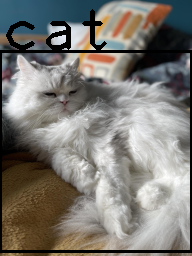

Execution Time: 1042 ms

# detect.yolo.myyolo.v6l
*Load with:*
```
{:class origami.filters.detect.yolo.MyYolo$V6L, :nmsThreshold 0.1, :scoreThreshold 0.7}
```
*Result:*


Execution Time: 330 ms

# detect.yolo.myyolo.v6m
*Load with:*
```
{:class origami.filters.detect.yolo.MyYolo$V6M, :nmsThreshold 0.1, :scoreThreshold 0.7}
```
*Result:*


Execution Time: 227 ms

# detect.yolo.myyolo.v6n
*Load with:*
```
{:class origami.filters.detect.yolo.MyYolo$V6N, :nmsThreshold 0.1, :scoreThreshold 0.7}
```
*Result:*


Execution Time: 241 ms

# detect.yolo.myyolo.v6s
*Load with:*
```
{:class origami.filters.detect.yolo.MyYolo$V6S, :nmsThreshold 0.1, :scoreThreshold 0.7}
```
*Result:*


Execution Time: 231 ms

# detect.yolo.myyolo.v6star
*Load with:*
```
{:class origami.filters.detect.yolo.MyYolo$V6Star, :network "networks.yolo:yolov6s:3.0", :nmsThreshold 0.1, :scoreThreshold 0.7}
```
*Result:*


Execution Time: 0 ms

# detect.yolo.yolov6
*Load with:*
```
{:class origami.filters.detect.yolo.YoloV6, :nmsThreshold 0.1, :scoreThreshold 0.7}
```
*Result:*


Execution Time: 0 ms

# dip.enhanceimagebrightness
*Load with:*
```
{:alpha 2.0, :beta 50.0, :class origami.filters.dip.EnhanceImageBrightness}
```
*Result:*


Execution Time: 1 ms

# dip.enhanceimagecontrast
*Load with:*
```
{:class origami.filters.dip.EnhanceImageContrast}
```
*Result:*


Execution Time: 4 ms

# dip.enhanceimagesharpness
*Load with:*
```
{:class origami.filters.dip.EnhanceImageSharpness}
```
*Result:*


Execution Time: 3 ms

# dip.erodingdilating
*Load with:*
```
{:class origami.filters.dip.ErodingDilating, :dilationSize 5, :erosionSize 5}
```
*Result:*


Execution Time: 2 ms

# dip.gaussianfilter
*Load with:*
```
{:class origami.filters.dip.GaussianFilter, :sigmaX 0, :size "11.0,11.0"}
```
*Result:*


Execution Time: 4 ms

# doge.glyphdetector
*Load with:*
```
{:chosenGlyphOffset 0.0, :chosenGlyphPosition nil, :class origami.filters.doge.GlyphDetector, :foundRect true, :frameSize #object[org.opencv.core.Size 0x67d4c48d "115x153"]}
```
*Result:*

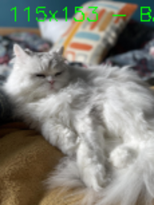

Execution Time: 16 ms

# doge.levicolorfilter
*Load with:*
```
{:class origami.filters.doge.LeviColorFilter, :color "RED", :threshold 164.0}
```
*Result:*


Execution Time: 1 ms

# inprogress.fake3d.v1
*Load with:*
```
{:brightness 50, :class origami.filters.inprogress.Fake3D$V1, :contrast 1.5}
```
*Result:*

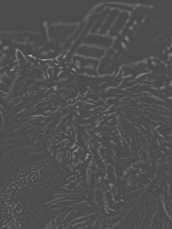

Execution Time: 4 ms

# inprogress.fake3d.v2
*Load with:*
```
{:class origami.filters.inprogress.Fake3D$V2}
```
*Result:*


Execution Time: 4 ms

# inprogress.fake3d.v3
*Load with:*
```
{:class origami.filters.inprogress.Fake3D$V3}
```
*Result:*


Execution Time: 0 ms

# inprogress.kandinsky
*Load with:*
```
{:class origami.filters.inprogress.Kandinsky}
```
*Result:*


Execution Time: 20 ms

# inprogress.kandinsky2
*Load with:*
```
{:class origami.filters.inprogress.Kandinsky2}
```
*Result:*


Execution Time: 21 ms

# inprogress.shadowfilter2
*Load with:*
```
{:class origami.filters.inprogress.ShadowFilter2}
```
*Result:*


Execution Time: 2 ms

# inprogress.waves
*Load with:*
```
{:class origami.filters.inprogress.Waves}
```
*Result:*


Execution Time: 2 ms

# instagram.lark
*Load with:*
```
{:class origami.filters.instagram.Lark}
```
*Result:*


Execution Time: 0 ms

# instagram.mayfair
*Load with:*
```
{:class origami.filters.instagram.Mayfair}
```
*Result:*

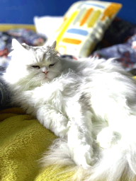

Execution Time: 1 ms

# instagram.sepia.gray
*Load with:*
```
{:class origami.filters.instagram.Sepia$Gray}
```
*Result:*


Execution Time: 5 ms

# instagram.sepia.red
*Load with:*
```
{:class origami.filters.instagram.Sepia$Red}
```
*Result:*

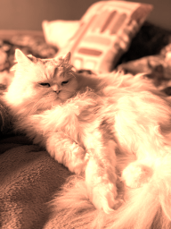

Execution Time: 0 ms

# instagram.sunglasses.blue
*Load with:*
```
{:alpha 0.8, :beta 0.2, :class origami.filters.instagram.SunGlasses$Blue, :color "255.0,0.0,0.0,0.0", :gamma 0.0}
```
*Result:*


Execution Time: 1 ms

# instagram.sunglasses.green
*Load with:*
```
{:alpha 0.8, :beta 0.2, :class origami.filters.instagram.SunGlasses$Green, :color "0.0,255.0,0.0,0.0", :gamma 0.0}
```
*Result:*

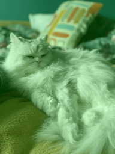

Execution Time: 0 ms

# instagram.sunglasses.purple
*Load with:*
```
{:alpha 0.8, :beta 0.2, :class origami.filters.instagram.SunGlasses$Purple, :color "128.0,0.0,128.0,0.0", :gamma 0.0}
```
*Result:*


Execution Time: 0 ms

# instagram.sunglasses.red
*Load with:*
```
{:alpha 0.8, :beta 0.2, :class origami.filters.instagram.SunGlasses$Red, :color "0.0,0.0,255.0,0.0", :gamma 0.0}
```
*Result:*

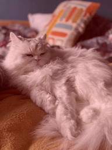

Execution Time: 0 ms

# instagram.sunglasses.salmon
*Load with:*
```
{:alpha 0.8, :beta 0.2, :class origami.filters.instagram.SunGlasses$Salmon, :color "114.0,128.0,250.0,0.0", :gamma 0.0}
```
*Result:*


Execution Time: 0 ms

# instagram.sunglasses.turquoise
*Load with:*
```
{:alpha 0.8, :beta 0.2, :class origami.filters.instagram.SunGlasses$Turquoise, :color "208.0,224.0,64.0,0.0", :gamma 0.0}
```
*Result:*


Execution Time: 1 ms

# instagram.sunglasses.yellow
*Load with:*
```
{:alpha 0.8, :beta 0.2, :class origami.filters.instagram.SunGlasses$Yellow, :color "0.0,255.0,255.0,0.0", :gamma 0.0}
```
*Result:*


Execution Time: 0 ms

# instagram.valencia
*Load with:*
```
{:class origami.filters.instagram.Valencia}
```
*Result:*


Execution Time: 0 ms

# instagram.vintage
*Load with:*
```
{:class origami.filters.instagram.Vintage}
```
*Result:*


Execution Time: 5 ms

# instagram.walden
*Load with:*
```
{:class origami.filters.instagram.Walden}
```
*Result:*


Execution Time: 1 ms

# instagram.gpt.gotham
*Load with:*
```
{:class origami.filters.instagram.gpt.Gotham}
```
*Result:*


Execution Time: 1 ms

# instagram.gpt.lark
*Load with:*
```
{:class origami.filters.instagram.gpt.Lark}
```
*Result:*


Execution Time: 1 ms

# instagram.gpt.mayfair
*Load with:*
```
{:class origami.filters.instagram.gpt.Mayfair}
```
*Result:*


Execution Time: 0 ms

# instagram.gpt.melbourne
*Load with:*
```
{:class origami.filters.instagram.gpt.Melbourne}
```
*Result:*


Execution Time: 0 ms

# instagram.gpt.nashville
*Load with:*
```
{:class origami.filters.instagram.gpt.Nashville}
```
*Result:*


Execution Time: 0 ms

# instagram.gpt.shadowenhance
*Load with:*
```
{:class origami.filters.instagram.gpt.ShadowEnhance}
```
*Result:*


Execution Time: 1 ms

# instagram.gpt.xproii
*Load with:*
```
{:class origami.filters.instagram.gpt.XProII}
```
*Result:*


Execution Time: 0 ms

# isaac.altmretinex
*Load with:*
```
{:class origami.filters.isaac.ALTMRetinex}
```
*Result:*

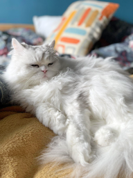

Execution Time: 44 ms

# isaac.darkchannelpriordehaze
*Load with:*
```
{:class origami.filters.isaac.DarkChannelPriorDehaze}
```
*Result:*


Execution Time: 39 ms

# isaac.fusionenhance
*Load with:*
```
{:class origami.filters.isaac.FusionEnhance}
```
*Result:*


Execution Time: 116 ms

# isaac.optimizecontrastenhance
*Load with:*
```
{:class origami.filters.isaac.OptimizeContrastEnhance}
```
*Result:*


Execution Time: 294 ms

# isaac.removeblackscatter
*Load with:*
```
{:class origami.filters.isaac.RemoveBlackScatter}
```
*Result:*


Execution Time: 413 ms

# runtime.runtimefilter
*Load with:*
```
{:class origami.filters.runtime.RuntimeFilter, :className "filters.myfilter", :watch false}
```
*Result:*


Execution Time: 260 ms

# video.earlydaysofcolortv
*Load with:*
```
{:class origami.filters.video.EarlyDaysOfColorTV}
```
*Result:*


Execution Time: 2 ms

# video.oldfilm
*Load with:*
```
{:class origami.filters.video.OldFilm}
```
*Result:*

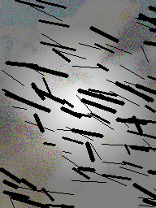

Execution Time: 19 ms

# video.terminator
*Load with:*
```
{:class origami.filters.video.Terminator}
```
*Result:*

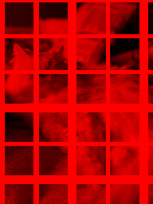

Execution Time: 16 ms

# video.vhs
*Load with:*
```
{:class origami.filters.video.VHS}
```
*Result:*


Execution Time: 0 ms

# video.vhsenhanced
*Load with:*
```
{:class origami.filters.video.VHSEnhanced}
```
*Result:*

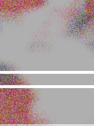

Execution Time: 4 ms

# video.sub.colordistortion
*Load with:*
```
{:class origami.filters.video.sub.ColorDistortion}
```
*Result:*


Execution Time: 0 ms

# video.sub.colorseparation
*Load with:*
```
{:class origami.filters.video.sub.ColorSeparation}
```
*Result:*


Execution Time: 0 ms

# video.sub.gridpattern.v1
*Load with:*
```
{:class origami.filters.video.sub.GridPattern$V1, :probability 0.02, :size 40}
```
*Result:*


Execution Time: 0 ms

# video.sub.gridpattern.v2
*Load with:*
```
{:class origami.filters.video.sub.GridPattern$V2, :spacing 45, :thickness 3}
```
*Result:*

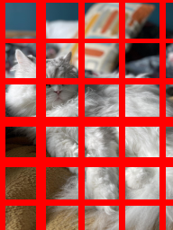

Execution Time: 0 ms

# video.sub.randomnoise
*Load with:*
```
{:class origami.filters.video.sub.RandomNoise}
```
*Result:*


Execution Time: 0 ms

# video.sub.redtint
*Load with:*
```
{:class origami.filters.video.sub.RedTint}
```
*Result:*

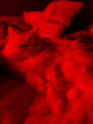

Execution Time: 13 ms

# video.sub.scanlines.fat
*Load with:*
```
{:class origami.filters.video.sub.ScanLines$Fat}
```
*Result:*


Execution Time: 0 ms

# video.sub.scanlines.simple
*Load with:*
```
{:class origami.filters.video.sub.ScanLines$Simple}
```
*Result:*


Execution Time: 9 ms

# video.sub.scratches
*Load with:*
```
{:class origami.filters.video.sub.Scratches}
```
*Result:*

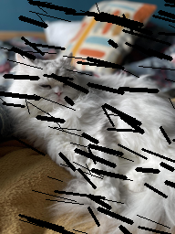

Execution Time: 0 ms

# video.sub.shufflechannels
*Load with:*
```
{:class origami.filters.video.sub.ShuffleChannels}
```
*Result:*


Execution Time: 0 ms

# video.sub.vignetting
*Load with:*
```
{:class origami.filters.video.sub.Vignetting}
```
*Result:*


Execution Time: 14 ms

# xphoto.channelgains
*Load with:*
```
{:blue 1.0, :class origami.filters.xphoto.ChannelGains, :green 1.0, :red 1.0}
```
*Result:*


Execution Time: 1 ms

# xphoto.dtcdenoising
*Load with:*
```
{:class origami.filters.xphoto.DtcDenoising, :psize 6, :sigma 21.0}
```
*Result:*


Execution Time: 2157 ms

# xphoto.grayworldwb
*Load with:*
```
{:class origami.filters.xphoto.GrayWorldWB, :saturationThreshold 0.9}
```
*Result:*


Execution Time: 0 ms

# xphoto.oilpainting
*Load with:*
```
{:class origami.filters.xphoto.OilPainting, :code 45, :ratio 1, :size 10}
```
*Result:*


Execution Time: 5 ms

# xphoto.simplewb
*Load with:*
```
{:class origami.filters.xphoto.SimpleWB, :inputMax 255.0, :inputMin 0.0, :outputMax 255.0, :outputMin 0.0, :p 1.0}
```
*Result:*


Execution Time: 0 ms

