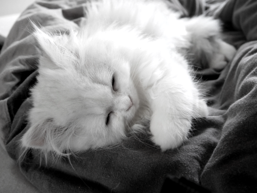
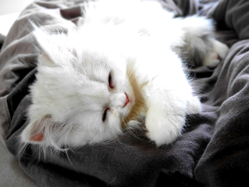
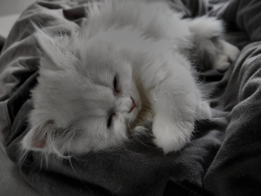

# Original

# NoOP
*Load with:*
```
{:class origami.Filters$NoOP}
```
*Result:*

# Annotate
*Load with:*
```
{:class origami.filters.Annotate, :color "255.0,255.0,255.0,0.0", :fontSize 3.0, :point "50.0,50.0", :text "hello", :thickness 3}
```
*Result:*

# BackgroundSubstractor
*Load with:*
```
{:class origami.filters.BackgroundSubstractor}
```
*Result:*

# BitwiseRed
*Load with:*
```
{:class origami.filters.BitwiseRed}
```
*Result:*

# Canny
*Load with:*
```
{:class origami.filters.Canny, :inverted true, :threshold1 100, :threshold2 200}
```
*Result:*

# Cartoon
*Load with:*
```
{:blockSize 9, :c 2, :class origami.filters.Cartoon, :d 13, :ksize 7, :maxValue 255.0, :sigmaColor 13, :sigmaSpace 7}
```
*Result:*

# Cartoon2
*Load with:*
```
{:class origami.filters.Cartoon2}
```
*Result:*

# ClojureFilter
*Load with:*
```
{:class origami.filters.ClojureFilter, :fn "(fn[mat] mat)"}
```
*Result:*

# ColorFilter
*Load with:*
```
{:class origami.filters.ColorFilter, :high 20, :low 0}
```
*Result:*

# Blue
*Load with:*
```
{:class origami.filters.ColorFilter$Blue, :high 240, :low 200}
```
*Result:*

# Pink
*Load with:*
```
{:class origami.filters.ColorFilter$Pink, :high 320, :low 300}
```
*Result:*

# Red
*Load with:*
```
{:class origami.filters.ColorFilter$Red, :high 20, :low 0}
```
*Result:*

# ColorMap
*Load with:*
```
{:class origami.filters.ColorMap}
```
*Result:*

# Autumn
*Load with:*
```
{:class origami.filters.ColorMap$Autumn}
```
*Result:*

# Bone
*Load with:*
```
{:class origami.filters.ColorMap$Bone}
```
*Result:*

# Cividis
*Load with:*
```
{:class origami.filters.ColorMap$Cividis}
```
*Result:*

# Cool
*Load with:*
```
{:class origami.filters.ColorMap$Cool}
```
*Result:*

# HSV
*Load with:*
```
{:class origami.filters.ColorMap$HSV}
```
*Result:*

# Hot
*Load with:*
```
{:class origami.filters.ColorMap$Hot}
```
*Result:*

# Jet
*Load with:*
```
{:class origami.filters.ColorMap$Jet}
```
*Result:*

# Magma
*Load with:*
```
{:class origami.filters.ColorMap$Magma}
```
*Result:*

# Ocean
*Load with:*
```
{:class origami.filters.ColorMap$Ocean}
```
*Result:*

# Parula
*Load with:*
```
{:class origami.filters.ColorMap$Parula}
```
*Result:*

# Pink
*Load with:*
```
{:class origami.filters.ColorMap$Pink}
```
*Result:*

# Rainbow
*Load with:*
```
{:class origami.filters.ColorMap$Rainbow}
```
*Result:*

# Spring
*Load with:*
```
{:class origami.filters.ColorMap$Spring}
```
*Result:*

# Summer
*Load with:*
```
{:class origami.filters.ColorMap$Summer}
```
*Result:*

# Turbo
*Load with:*
```
{:class origami.filters.ColorMap$Turbo}
```
*Result:*

# Twilight
*Load with:*
```
{:class origami.filters.ColorMap$Twilight}
```
*Result:*

# TwilightShifted
*Load with:*
```
{:class origami.filters.ColorMap$TwilightShifted}
```
*Result:*

# Viridis
*Load with:*
```
{:class origami.filters.ColorMap$Viridis}
```
*Result:*

# Winter
*Load with:*
```
{:class origami.filters.ColorMap$Winter}
```
*Result:*

# Contours
*Load with:*
```
{:class origami.filters.Contours, :color "256.0,150.0,0.0,0.0", :linetype 8, :offset "0.0,0.0", :thickness 2, :threshold 100}
```
*Result:*

# CoolCanny
*Load with:*
```
{:class origami.filters.CoolCanny, :inverted false}
```
*Result:*

# DetailEnhance
*Load with:*
```
{:class origami.filters.DetailEnhance, :sigma_r 0.15, :sigma_s 10.0}
```
*Result:*

# DynamicAnnotate
*Load with:*
```
{:class origami.filters.DynamicAnnotate, :color "255.0,255.0,255.0,0.0", :fontSize 3.0, :point "50.0,50.0", :text "(str (java.util.Date.))", :thickness 3}
```
*Result:*

# EastTextDetector
*Load with:*
```
{:class origami.filters.EastTextDetector}
```
*Result:*

# EdgePreserving
*Load with:*
```
{:class origami.filters.EdgePreserving, :flags 1, :sigma_r 0.4, :sigma_s 60.0}
```
*Result:*

# EnhanceImageSharpness
*Load with:*
```
{:class origami.filters.EnhanceImageSharpness}
```
*Result:*

# FPS
*Load with:*
```
{:class origami.filters.FPS}
```
*Result:*

# FastDenoising
*Load with:*
```
{:class origami.filters.FastDenoising}
```
*Result:*

# Fisheye
*Load with:*
```
{:cX 300.0, :cY 540.0, :class origami.filters.Fisheye, :fishVal 600.0}
```
*Result:*

# Gray
*Load with:*
```
{:class origami.filters.Gray}
```
*Result:*

# Grayscale
*Load with:*
```
{:class origami.filters.Grayscale}
```
*Result:*

# GreenLantern
*Load with:*
```
{:class origami.filters.GreenLantern}
```
*Result:*

# HOG
*Load with:*
```
{:class origami.filters.HOG}
```
*Result:*

# HttpGet
*Load with:*
```
{:class origami.filters.HttpGet, :interval -1, :url nil}
```
*Result:*

# Gotham
*Load with:*
```
{:class origami.filters.HueSaturationValue$Gotham}
```
*Result:*

# Lomo
*Load with:*
```
{:class origami.filters.HueSaturationValue$Lomo}
```
*Result:*

# Nashville
*Load with:*
```
{:class origami.filters.HueSaturationValue$Nashville}
```
*Result:*

# Pink
*Load with:*
```
{:class origami.filters.HueSaturationValue$Pink}
```
*Result:*

# Illumination
*Load with:*
```
{:alpha 3.0, :beta 0.4, :class origami.filters.Illumination}
```
*Result:*

# LUTCartoon
*Load with:*
```
{:class origami.filters.LUTCartoon}
```
*Result:*

# Level
*Load with:*
```
{:class origami.filters.Level, :n 100}
```
*Result:*

# Manga
*Load with:*
```
{:class origami.filters.Manga}
```
*Result:*

# V2
*Load with:*
```
{:class origami.filters.MyYolo$V2}
```
*Result:*

# V2Tiny
*Load with:*
```
{:class origami.filters.MyYolo$V2Tiny}
```
*Result:*

# V3
*Load with:*
```
{:class origami.filters.MyYolo$V3}
```
*Result:*

# V3Tiny
*Load with:*
```
{:class origami.filters.MyYolo$V3Tiny}
```
*Result:*

# V4
*Load with:*
```
{:class origami.filters.MyYolo$V4}
```
*Result:*

# NoOPFilter
*Load with:*
```
{:class origami.filters.NoOPFilter}
```
*Result:*

# PencilSketch
*Load with:*
```
{:class origami.filters.PencilSketch}
```
*Result:*

# Resize
*Load with:*
```
{:class origami.filters.Resize, :factor -1.0, :height -1.0, :width -1.0}
```
*Result:*

# Rotate180
*Load with:*
```
{:class origami.filters.Rotate$Rotate180, :rotateAngle 1}
```
*Result:*

# Rotate270
*Load with:*
```
{:class origami.filters.Rotate$Rotate270, :rotateAngle 2}
```
*Result:*

# Rotate90
*Load with:*
```
{:class origami.filters.Rotate$Rotate90, :rotateAngle 0}
```
*Result:*

# Gray
*Load with:*
```
{:class origami.filters.Sepia$Gray}
```
*Result:*

# Red
*Load with:*
```
{:class origami.filters.Sepia$Red}
```
*Result:*

# Stilyze
*Load with:*
```
{:class origami.filters.Stilyze, :sigma_r 0.07, :sigma_s 60.0}
```
*Result:*

# Blue
*Load with:*
```
{:alpha 0.8, :beta 0.2, :class origami.filters.SunGlasses$Blue, :color "255.0,0.0,0.0,0.0", :gamma 0.0}
```
*Result:*

# Green
*Load with:*
```
{:alpha 0.8, :beta 0.2, :class origami.filters.SunGlasses$Green, :color "0.0,255.0,0.0,0.0", :gamma 0.0}
```
*Result:*

# Purple
*Load with:*
```
{:alpha 0.8, :beta 0.2, :class origami.filters.SunGlasses$Purple, :color "128.0,0.0,128.0,0.0", :gamma 0.0}
```
*Result:*

# Red
*Load with:*
```
{:alpha 0.8, :beta 0.2, :class origami.filters.SunGlasses$Red, :color "0.0,0.0,255.0,0.0", :gamma 0.0}
```
*Result:*

# Salmon
*Load with:*
```
{:alpha 0.8, :beta 0.2, :class origami.filters.SunGlasses$Salmon, :color "114.0,128.0,250.0,0.0", :gamma 0.0}
```
*Result:*

# Turquoise
*Load with:*
```
{:alpha 0.8, :beta 0.2, :class origami.filters.SunGlasses$Turquoise, :color "208.0,224.0,64.0,0.0", :gamma 0.0}
```
*Result:*

# Yellow
*Load with:*
```
{:alpha 0.8, :beta 0.2, :class origami.filters.SunGlasses$Yellow, :color "0.0,255.0,255.0,0.0", :gamma 0.0}
```
*Result:*

# Thresh
*Load with:*
```
{:class origami.filters.Thresh}
```
*Result:*

# Vintage
*Load with:*
```
{:class origami.filters.Vintage}
```
*Result:*

# Zoom
*Load with:*
```
{:class origami.filters.Zoom}
```
*Result:*

# ALTMRetinex
*Load with:*
```
{:class origami.filters.isaac.ALTMRetinex}
```
*Result:*

# DarkChannelPriorDehaze
*Load with:*
```
{:class origami.filters.isaac.DarkChannelPriorDehaze}
```
*Result:*

# FusionEnhance
*Load with:*
```
{:class origami.filters.isaac.FusionEnhance}
```
*Result:*

# OptimizeContrastEnhance
*Load with:*
```
{:class origami.filters.isaac.OptimizeContrastEnhance}
```
*Result:*

# RemoveBlackScatter
*Load with:*
```
{:class origami.filters.isaac.RemoveBlackScatter}
```
*Result:*

