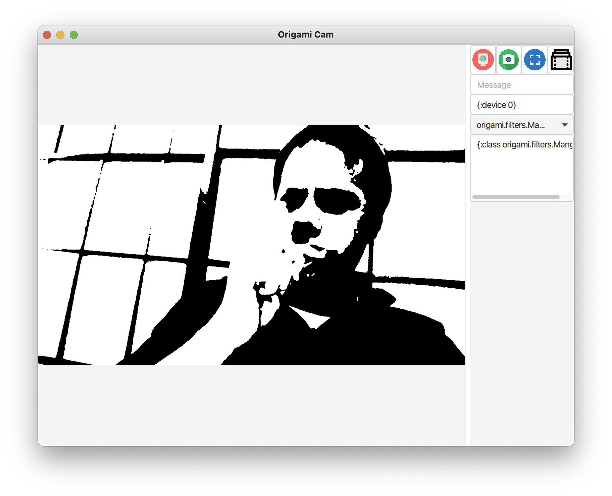
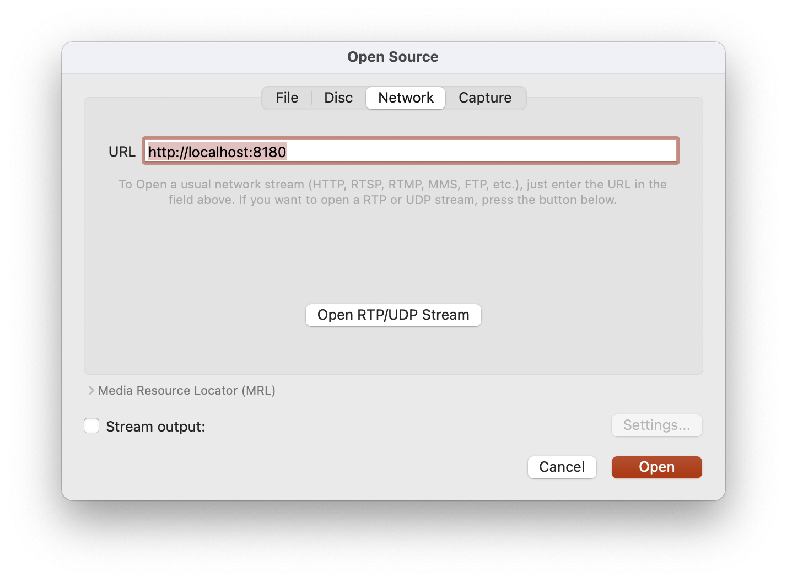
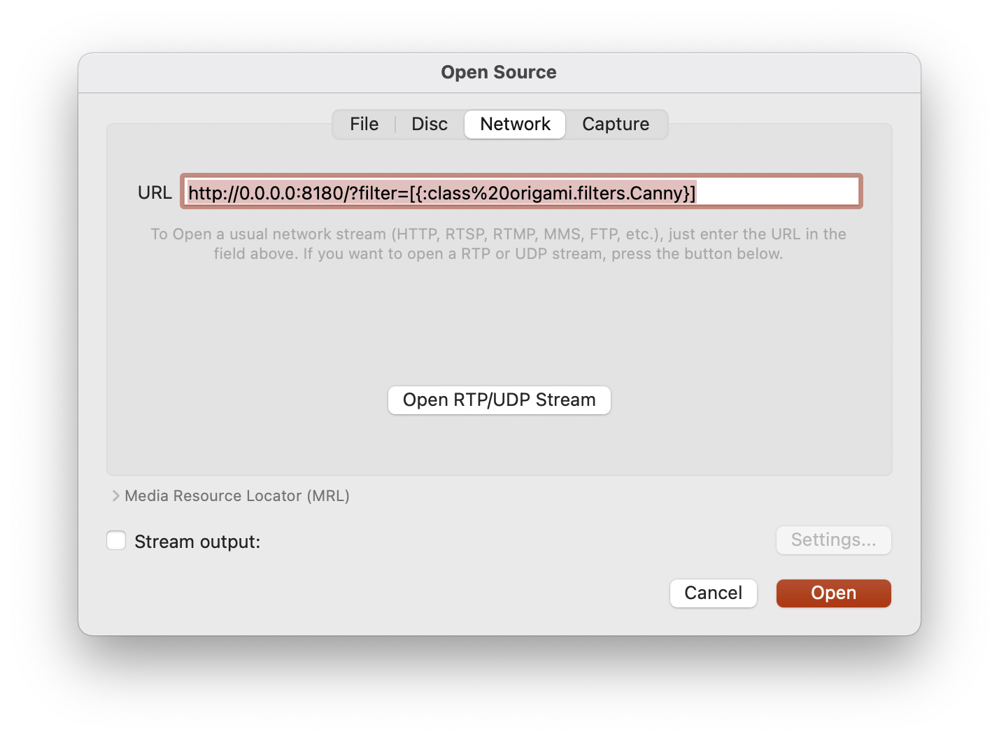
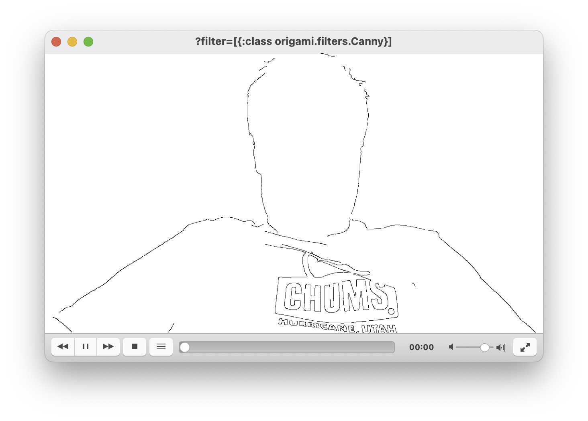

Download it from here: [streamer](http://repository.hellonico.info/repository/hellonico/origami/streamer/0.7/streamer-0.7.jar)

# Start the stream

The stream can be started with the following command:

```shell
java -jar streamer.jar
```

or with a set of start options

```shell
java -jar streamer.jar <ip?> <port?> <device>?
```

where:

- ip: defaults to 0.0.0.0
- port: defaults to 8180
- device: defaults to camera device  0

And then you can access the stream via http.

http://localhost:8180

# Apply a filter

You can load a filter file, located on the device streaming, using the filter parameter:

http://localhost:8180?filter=cam.edn



In this case, the *cam.edn* content is:

```
[{:class origami.filters.DynamicAnnotate :point "0,200" :text "(str (java.util.Date.))"}
 {:class origami.filters.DynamicAnnotate :point "0,100" :text "(str \"OpenCV \" (org.opencv.core.Core/VERSION))"}]
```

You can also apply the filter directly by passing it in the parameter itself:

```
http://0.0.0.0:8180/?filter=[{:class%20origami.filters.Resize%20:factor%200.5}]
```

*Note:  You can use filters as defined in [Filters](units/filters.md)*

# Access via VLC

You can access the http stream from VLC, via the menu "Open Network", and specify the URL as shown below.



And, as above, you can pass the filter parameter direclty in the URL:



And the stream coming to VLC will have the filter being applied to it:



