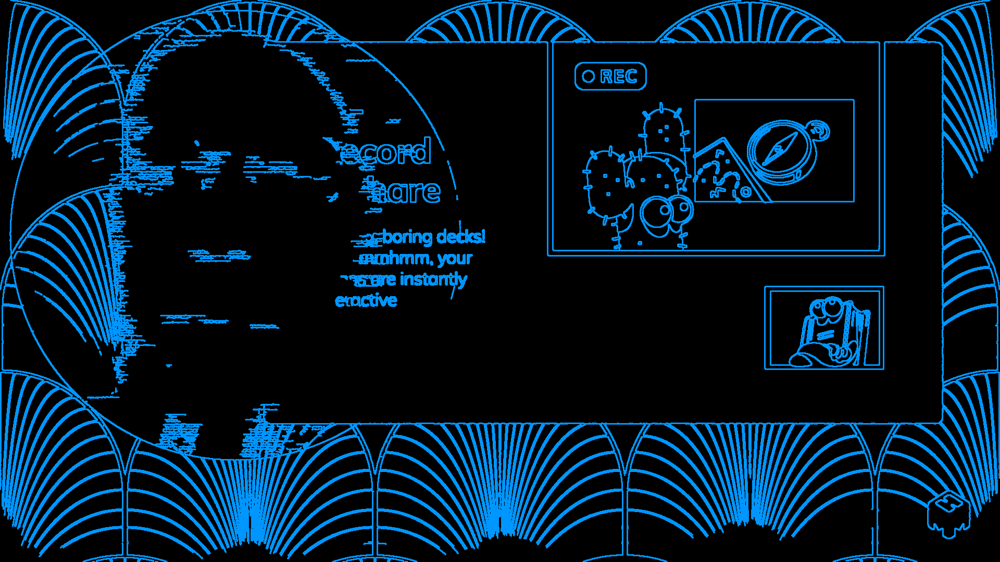
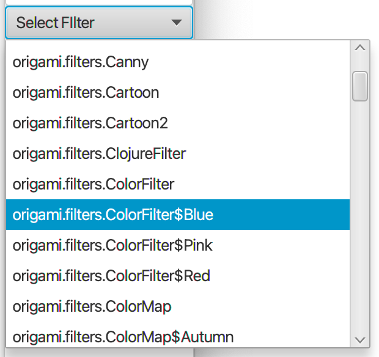
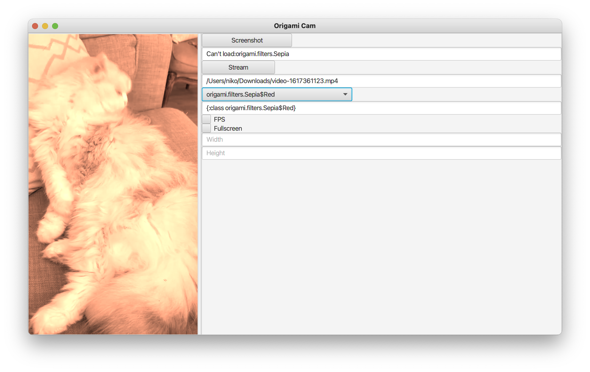
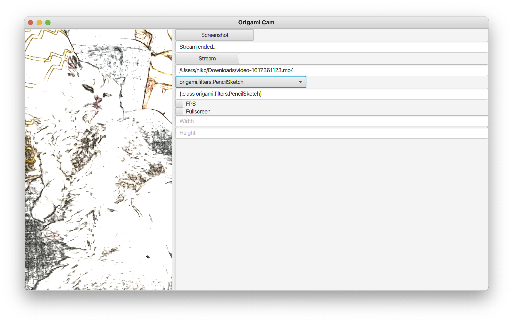
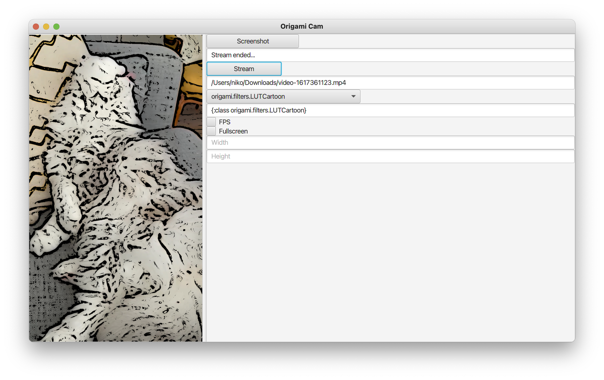
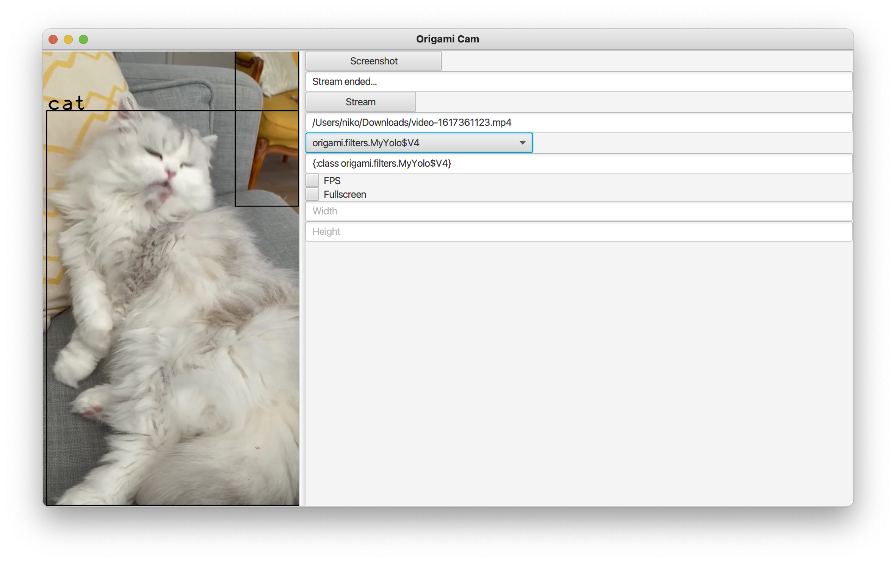

Download it from here: [Booth](http://repository.hellonico.info/repository/hellonico/origami/booth/0.8/booth-0.8.jar)

## new features  

### 0.9.2

- Support for native [Windows installer](http://repository.hellonico.info/repository/hellonico/origami/booth-windows/1.0/booth-windows-1.0.exe)

### 0.9

- new origami release (with opencv 4.7.0)

### 0.8

- Using updated filters, so that filters requiring xml (or other) config files can now use the new Fetcher to get those config.

### 0.7

- Copy last shot path to clipboard
- Show last image and on click open the picture
- Add tooltips on buttons
- Add timer for shot (10s)

*Requires a JDK/JRE with javafx.*

At this stage this is a prototype version to view stream from a camera, file, or any other input origami source.

A large list of filters is available by default, and you can easily write your own custom.

A few screenshots are shown below with marcel le chat viewed through different filters.

